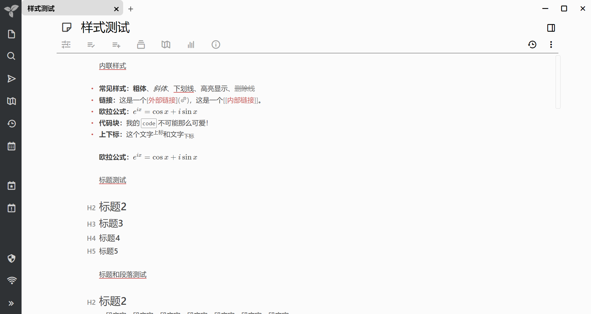
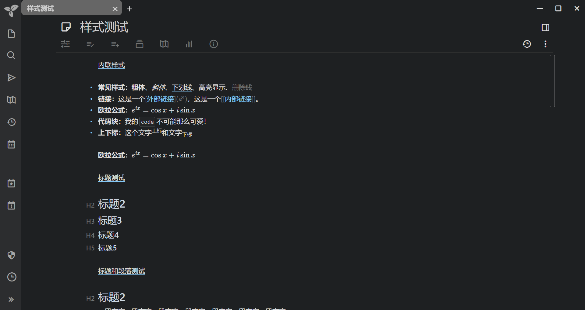

# Trilium Theme: Bear Note

A [bear note](https://bear.app) style theme for the [Trilium Notebook app](https://github.com/zadam/trilium).

You can refer to [this wiki page](https://github.com/zadam/trilium/wiki/Themes) to install the theme.

## Features

- White theme & dark theme
- Provide options at begin of css for anyone who want to customize your own favors (colors, spacing, etc.)
- Perfect Alignment (better than bear note), especially for CJK characters

## Screenshots

## Todos

Important

- [x] ul、ol 试一下 blockquote 的方式，修正 katex 的错误
- [x] 调整表格的样式
- [x] 调整 iPad 的样式（字体变小的，UI精细点）
- [ ] 调整预览框中的样式

不重要：

- [ ] ul、ol 在表格中有偏移问题
- [ ] 调整标题输入框的样式
- [ ] 调整代码的字体
- [ ] 调整滚动条的样式
